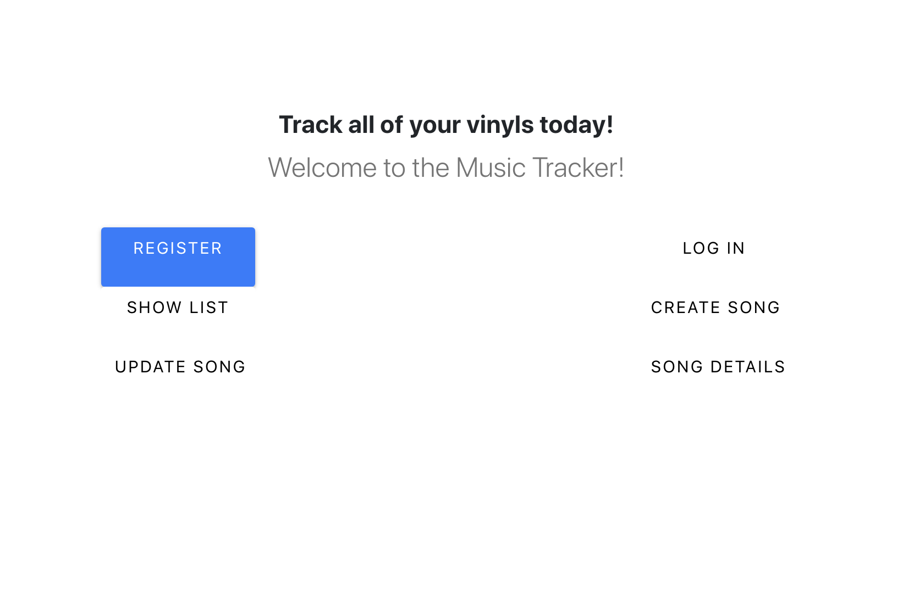
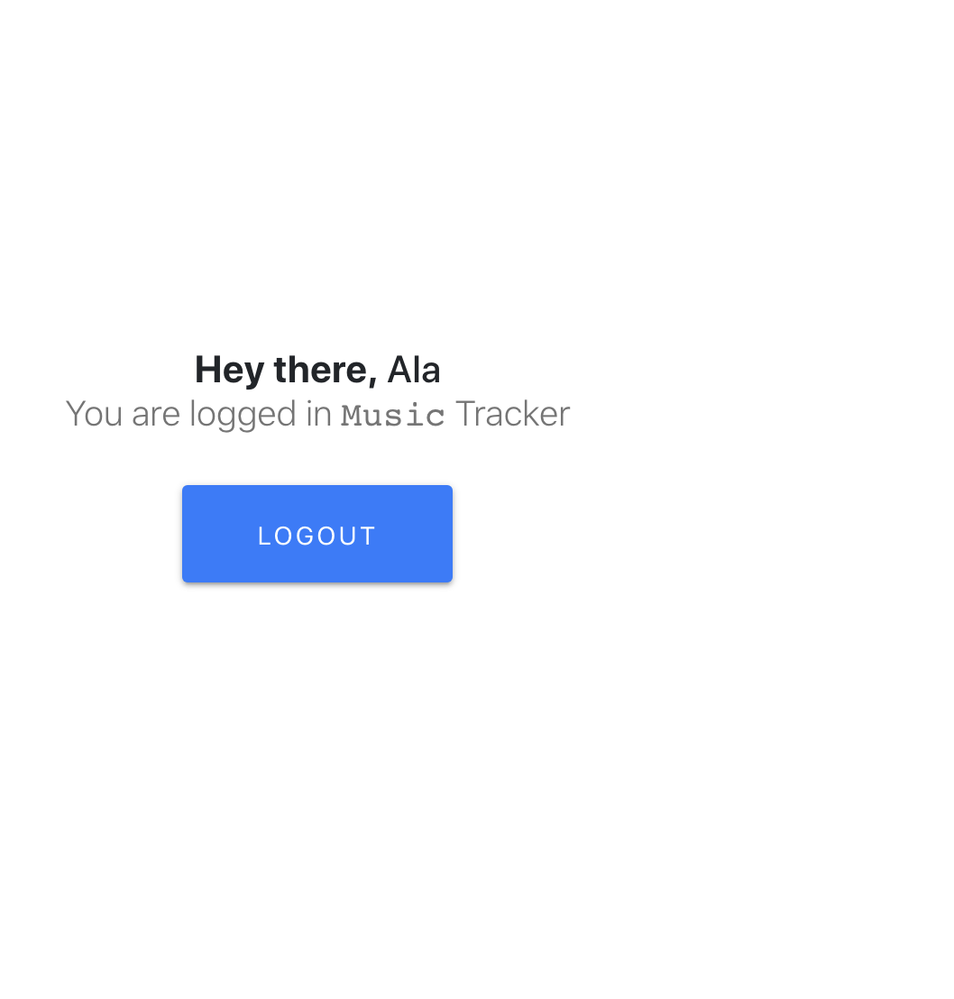
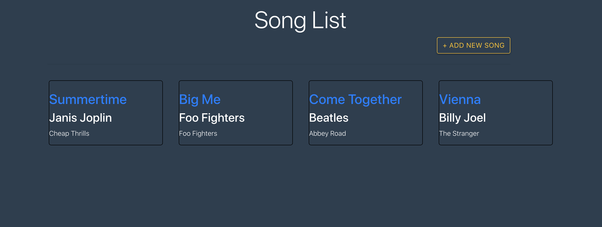

## Music Tracker

## Description
MERN application deployed to Heroku to help the user have their own music library

## Functionality
The app allows you to Add, Edit and Delete entries so that you can have your own personal music library with some trivia tidbits.

## User Story
AS someone who collects vinyl records,
I want a way to track the records that I own,
SO that I don't end up with multiple copies of the same record

## Technologies Used
MongoDB
Express
React
Node.js
Heroku
PropTypes and Higher Order Components for Authentication
Passport and JWTs for User Authentication

## Screenshots

For more images please go to the img folder.

## Deployed Link(s)

Link1: Full app with user authentication etc: https://mtrackeraks.herokuapp.com/

Link 2: App without user authentication: https://musicaks.herokuapp.com

## Credit
https://blog.logrocket.com/mern-stack-tutorial/
https://blog.bitsrc.io/build-a-login-auth-app-with-mern-stack-part-1-c405048e3669

